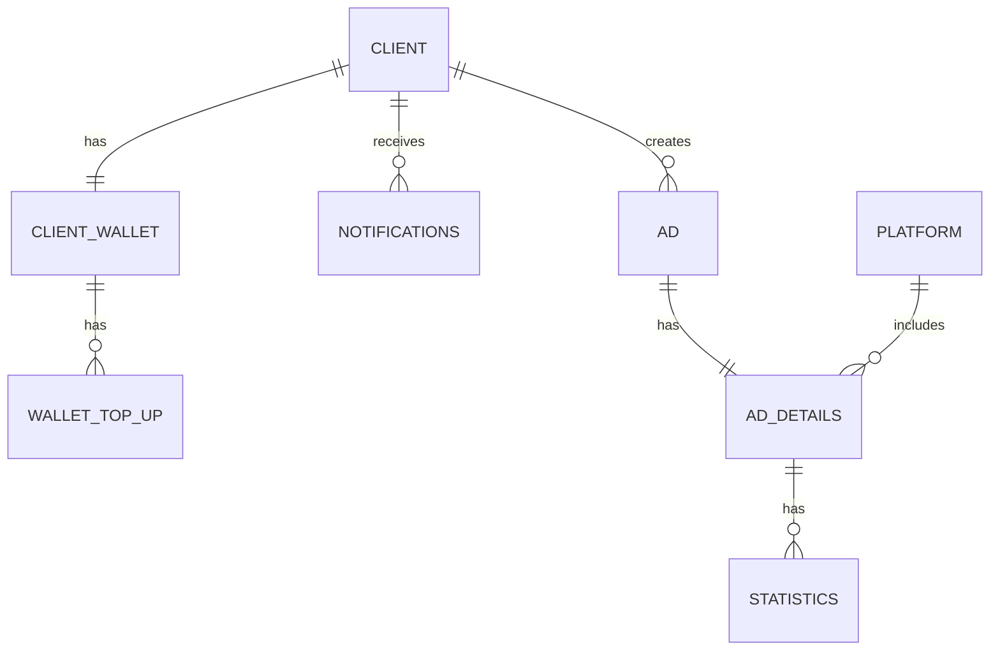

## client ##
Базовая информация обо всех пользователях системы 

* id: Уникальный идентификатор пользователя в базе данных
* name: Имя пользователя (пользователь вводит при регистрации)
* email: Почта, указанная при регистрации
* password_hash (Хранится хэш от пароля пользователя)
* created_at: Дата и время создания записи
* updated_at: Дата и время последнего обновления записи

## client_wallet ##
Таблица с информацией о кошельках клиентов.

* id: Уникальный идентификатор кошелька
* client_id: Идентификатор клиента (ссылка на client)
* balance: Баланс кошелька
* created_at: Дата и время создания записи
* updated_at: Дата и время последнего обновления записи

## wallet_top_up ##
Таблица с данными о пополнении кошелька клиента.

* id: Уникальный идентификатор записи
* client_wallet_id: Идентификатор кошелька клиента (ссылка на client_wallet)
* amount: Сумма пополнения
* payment_method: Метод оплаты
* status: Статус операции
* created_at: Дата и время создания записи

## notifications ##
Таблица с информацией о уведомлениях клиента.

* id: Уникальный идентификатор записи
* client_id: Идентификатор клиента (ссылка на client)
* notification_text: Текст уведомления
* type: Тип уведомления
* created_at: Дата и время создания записи

## platform ##
Таблица с информацией о платформах.

* id: Уникальный идентификатор платформы
* platform_name: Название платформы
* created_at: Дата и время создания записи

## ad ##
Таблица с данными о рекламе.

* id: Уникальный идентификатор рекламы
* client_id: Идентификатор клиента (ссылка на client)
* title: Заголовок рекламы
* content: Содержание рекламы
* img_bin: Бинарные данные изображения
* target_url: Целевая ссылка
* start_date: Дата начала
* end_date: Дата окончания

## ad_details ##
Детали рекламы.

* id: Уникальный идентификатор
* ad_id: Идентификатор рекламы
* platform_id: Идентификатор платформы (ссылка на platform)
* amount_for_ad: Сумма за рекламу
* status: Активна или нет
* start_date: Дата начала
* end_date: Дата окончания

## statistics ##
Статистические показатели по рекламе.

* id: Уникальный идентификатор
* ad_details_id: Идентификатор деталей рекламы (ссылка на ad_details)
* clicks: Количество кликов
* impressions: Количество показов
* created_at: Дата и время создания записи
* last_update: Дата последнего обновления

## erDiagram ##


```mermaid
erDiagram
    CLIENT {
        _ id PK
        _ name "AK"
        _ email "AK"
        _ password_hash
        _ created_at
        _ updated_at
    }
    CLIENT_WALLET {
        _ id PK
        _ client_id "AK" 
        _ balance
        _ created_at
        _ updated_at
    }
    WALLET_TOP_UP {
        _ id PK
        _ client_wallet_id FK
        _ amount
        _ payment_method
        _ status
        _ created_at
    }
    NOTIFICATIONS {
        _ id PK
        _ client_id FK
        _ notification_text
        _ type
        _ created_at
    }
    PLATFORM {
        _ id PK
        _ platform_name "AK" 
        _ created_at
    }
    AD {
        _ id PK
        _ client_id FK
        _ title
        _ content
        _ img_bin
        _ target_url
        _ start_date
        _ end_date
    }
    AD_DETAILS {
        _ id "PK"
        _ ad_id FK "AK"
        _ platform_id FK
        _ amount_for_ad
        _ status
        _ start_date
        _ end_date
    }
    STATISTICS {
        _ id "PK"
        _ ad_details_id FK "AK" 
        _ clicks
        _ impressions
        _ created_at
        _ last_update
    }
    CLIENT ||--|| CLIENT_WALLET : has
    CLIENT ||--o{ NOTIFICATIONS : receives
    CLIENT ||--o{ AD : creates
    
    CLIENT_WALLET ||--o{ WALLET_TOP_UP : has
    
    AD ||--|| AD_DETAILS : has
    PLATFORM ||--o{ AD_DETAILS : includes
    AD_DETAILS ||--o{ STATISTICS : has
    
    

