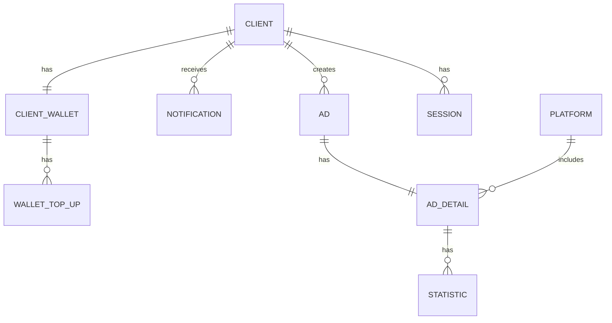
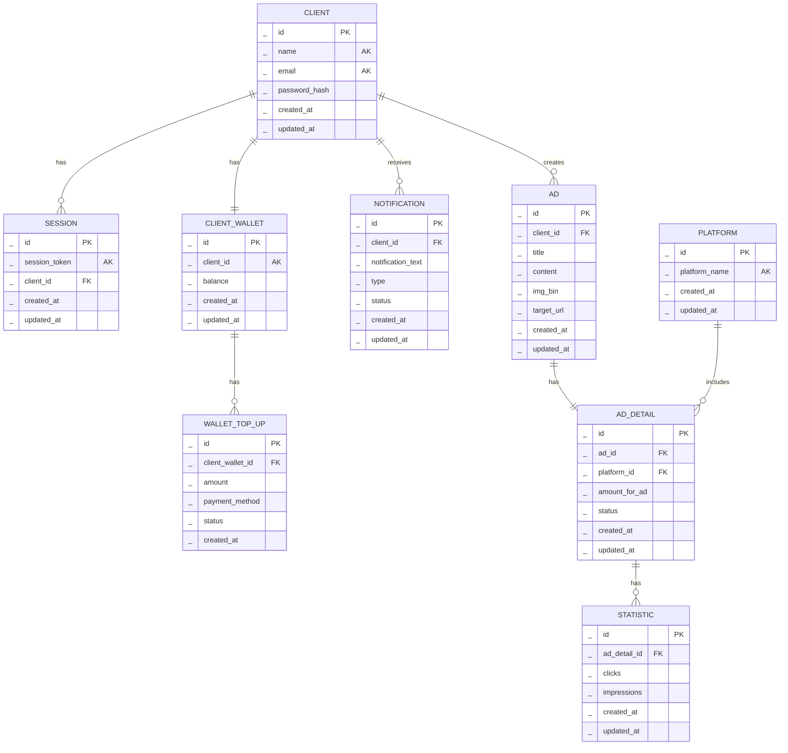

## client ##
Базовая информация обо всех пользователях системы 

* id: Уникальный идентификатор пользователя в базе данных
* name: Имя пользователя (пользователь вводит при регистрации)
* email: Почта, указанная при регистрации
* password_hash (Хранится хэш от пароля пользователя)
* created_at: Дата и время создания записи
* updated_at: Дата и время последнего обновления записи

## client_wallet ##
Таблица с информацией о кошельках клиентов.

* id: Уникальный идентификатор кошелька
* client_id: Идентификатор клиента (ссылка на client)
* balance: Баланс кошелька
* created_at: Дата и время создания записи
* updated_at: Дата и время последнего обновления записи

## wallet_top_up ##
Таблица с данными о пополнении кошелька клиента.

* id: Уникальный идентификатор записи
* client_wallet_id: Идентификатор кошелька клиента (ссылка на client_wallet)
* amount: Сумма пополнения
* payment_method: Метод оплаты
* status: Статус операции
* created_at: Дата и время создания записи

## notifications ##
Таблица с информацией о уведомлениях клиента.

* id: Уникальный идентификатор записи
* client_id: Идентификатор клиента (ссылка на client)
* notification_text: Текст уведомления
* type: Тип уведомления
* status: Статус уведомления(прочитано или нет)
* created_at: Дата и время создания записи
* updated_at: Дата и время последнего обновления записи

## platform ##
Таблица с информацией о платформах.

* id: Уникальный идентификатор платформы
* platform_name: Название платформы
* created_at: Дата и время создания записи
* updated_at: Дата и время последнего обновления записи

## ad ##
Таблица с данными о рекламе.

* id: Уникальный идентификатор рекламы
* client_id: Идентификатор клиента (ссылка на client)
* title: Заголовок рекламы
* content: Содержание рекламы
* img_bin: Бинарные данные изображения
* target_url: Целевая ссылка
* created_at: Дата и время создания записи
* updated_at: Дата и время последнего обновления записи

## ad_details ##
Детали рекламы.

* id: Уникальный идентификатор
* ad_id: Идентификатор рекламы
* platform_id: Идентификатор платформы (ссылка на platform)
* amount_for_ad: Сумма за рекламу
* status: Активна или нет
* created_at: Дата и время создания записи
* updated_at: Дата и время последнего обновления записи

## statistics ##
Статистические показатели по рекламе.

* id: Уникальный идентификатор
* ad_details_id: Идентификатор деталей рекламы (ссылка на ad_details)
* clicks: Количество кликов
* impressions: Количество показов
* created_at: Дата и время создания записи
* updated_at: Дата и время последнего обновления записи

## session ##
Хранение сеесий для аутентификации пользователя

* id: Уникальный идентификатор
* session_token: Сессионный токен
* client_id: Идентификатор пользователя
* created_at: Дата и время создания записи
* updated_at: Дата и время последнего обновления записи

## ER-диаграмма(min) ##


## ER-диаграмма ##



# Функциональные зависимости #

## client ##
```
{id} → {name, emaol, created_at, updated_at}
{email} → {id, password_hash, created_at, updated_at}  
{email} → {id} 
```
## client_wallet ##
```
{client_id} → {balance}
{id} → {balance, created_at, updated_at}
```
## wallet_top_up ##
```
{client_wallet_id} → {amount, payment_method, status, created_at}
{id} → {client_wallet_id, amount}
```
## notifications ##
```
{client_id} → {notification_text, type, status, created_at}
{id} → {status, created_at, updated_at}
```
## platform ##
```
{id} → {platform_name, created_at, updated_at}
```
## ad ##
```
{client_id} → {id, title, content, img_bin, target_url}
{id} → {title, content, img_bin, target_url, created_at, updated_at}
```
## ad_details ##
```
{ad_id} → {platform_id, amount_for_ad, status, created_at}
{ad_id} → {status, created_at, updated_at}
```
## statistics ##
```
{ad_details_id} → {clicks, impressions, created_at, updated_at}
```
## session ##
```
{client_id} → {session_token}
{session_token} → {client_id}
```

# Доказательство соответствия нормальным формам #
1. ## Первая нормальная форма (1NF) ##
Все атрибуты атомарны, отсутствуют повторяющиеся группы и составные типы данных.

2. ## Вторая нормальная форма (2NF) ##
Отсутствуют частичные зависимости неключевых атрибутов от составных первичных ключей. 

3. ## Третья нормальная форма (3NF) ##
Отсутствуют транзитивные зависимости неключевых атрибутов.

4. ## Нормальная форма Бойса-Кодда (НФБК) ##
Каждый детерминант является потенциальным ключом.